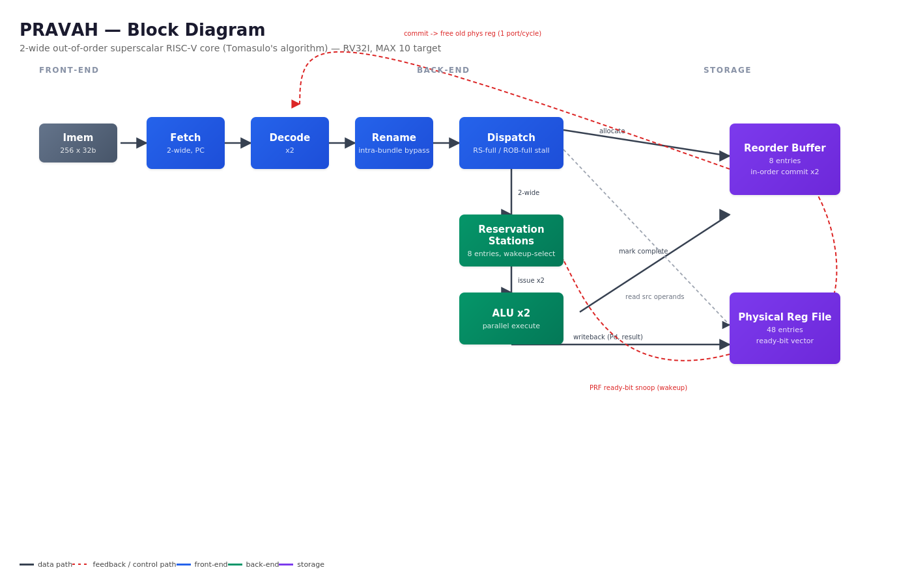

# PRAVAH (प्रवाह — "flow")

**A 2-wide out-of-order superscalar RISC-V processor, implemented from scratch in synthesizable Verilog.**

Built as part of Seasons of Code 2026, IIT Bombay. PRAVAH implements Tomasulo's algorithm — register renaming, reservation stations, out-of-order dispatch and execution, and in-order commit via a reorder buffer — the same architectural principles that power modern out-of-order cores like Apple's M-series and AMD's Zen.

---

## Overview

PRAVAH fetches two RV32I instructions per cycle, renames architectural registers to a pool of physical registers to eliminate false (WAW/WAR) dependencies, dispatches instructions out of program order into reservation stations as soon as their operands are ready, executes them on parallel ALUs, and commits results back in strict program order through an 8-entry reorder buffer. The goal is architectural, not performance: to build — not just study — the mechanism that lets a scalar-in-order-looking programmer's model run on genuinely out-of-order hardware underneath.

## Architecture



**Pipeline:** Fetch (×2) → Decode (×2) → Rename → Dispatch → Reservation Stations → Execute (2× ALU) → Reorder Buffer (commit, in-order, ×2)

| Structure | Size |
|---|---|
| Physical register file | 48 entries (32 architectural + 16 renaming registers) |
| Reservation stations | 8 entries, shared across 2 ALUs |
| Reorder buffer | 8 entries |
| Fetch/decode/dispatch width | 2-wide |
| Commit width | 1 physical-register-free per cycle (see Limitations) |

## Features

- 2-wide in-order fetch and decode
- Register renaming via a physical register file and free list (eliminates WAW/WAR hazards)
- Intra-bundle dependency handling (slot B correctly sees slot A's rename within the same cycle)
- 8-entry reservation stations with mask-and-encode wakeup/select logic (2 issues/cycle)
- Out-of-order dispatch and execution across 2 ALUs
- 8-entry reorder buffer enforcing strict in-order commit
- Cycle-accurate IPC measurement harness
- Synthesizes cleanly on Intel MAX 10 (10M50DAF484C7G) via Quartus Prime

## Results

### IPC (Instructions Per Cycle)

| Benchmark    | Instructions Committed | First Commit Cycle  | Last Commit Cycle  | End-to-End IPC  | Steady-State IPC |
|--------------|:----------------------:|:-------------------:|:------------------:|:---------------:|:------------------:|
| Independent  |       16 / 16          |        3            |        10          |       1.6       |     2.0            |
| Chain        |       16 / 16          |        3            |        18          |       0.889     |     1.0            |
| Mixed        |       16 / 16          |        3            |        11          |       1.4545    |     1.7778         |

Full methodology and gap analysis: [`docs/performance.md`](docs/performance.md)

### Synthesis (Intel MAX 10, 10M50DAF484C7G)

- Fmax (Slow 1200mV 85C): 85.8 MHz
- Total logic elements: 332
- Total registers: 139
- Critical path: RS wakeup-select loop (PRF ready bit → per-entry ready compare → priority-encode issue select → issue mux → ALU → PRF writeback)

## Repository Structure

```text
pravah/
|-- README.md
|-- Rtl/
|   |-- fetch.v
|   |-- decode.v
|   |-- rename_unit.v
|   |-- register_file.v
|   |-- reservation_station.v
|   |-- rob.v
|   |-- alu.v
|   |-- pravah_top.v
|   |-- dispatch.v
|-- sim/
|   |-- (ModelSim scripts and waveform screenshots)
|-- docs/
|   |-- week 7/
|   |   |-- quartus_resource_utilisation.png
|   |   |-- quartus_timing.png
|   |-- design_decisions.md
|   |-- performance.md
|   |-- final_report.pdf
|   |-- block_diagram.png
|   |-- retrospective.md
|-- programs/
|   |-- dot_product.hex
|   |-- bench_independent.hex
|   |-- bench_chain.hex
|   |-- bench_mixed.hex
|   |-- test1.hex
|-- quartus/
|   |-- pravah.qpf
|-- tb/
|   |-- tb_register_file.v
|   |-- tb_rename_unit.v
|   |-- tb_reservation_station.v
|   |-- tb_pravah_top.v
|   |-- tb_pravah_perf.v
|   |-- tb_frontend.v
|   |-- week2/
|   |-- week1/
|-- .gitignore
```

## Build and Run

### Prerequisites

- Quartus Prime Lite (tested with 18.1)
- ModelSim — Intel Starter Edition (Run indepndently) (I have used segragately because of directory problem but can be bundled as well)
  
### Simulate a single module ROB test
```bash
cd "E:/SOS proj"

vlib work
vlog rob.v tb_rob.v
vsim -c -do "run -all; quit" tb_rob
```

### Run the full integration test
```bash
cd "E:/SOS proj"
vlib work
vmap work work
vlog fetch.v decode.v rename_unit.v dispatch.v register_file.v reservation_station.v alu.v rob.v pravah_top.v tb_pravah_perf.v
vsim work.tb_pravah_perf
run -all
```

### Expected output: "PASS" with final register values matching reference.
### x1=2, x2=3, x3=5, x4=7, x5=34, x6=36, x7=17

### Measure IPC
```bash
vlog fetch.v decode.v rename_unit.v dispatch.v register_file.v reservation_station.v alu.v rob.v pravah_top.v tb_pravah_perf.v
vsim -c -do "run -all; quit" tb_pravah_perf
```
### Reports IPC for each benchmark:
### Independent: 1.6
### Chain:       0.8889
### Mixed:       1.4545

> **Note:** In the `cd` command, write the path where all RTL and testbench files are stored.
> Example:
>
> ```bash
> cd "E:/SOS proj"
> ``

### Synthesize (Quartus)

1. Create a new Quartus project, target device MAX 10 (`10M50DAF484C7G`).
2. Add all files under `rtl/` to the project (do **not** add `tb/` — testbenches are not synthesizable).
3. Set `pravah_top` as the top-level entity.
4. Add `quartus/pravah.sdc` as the SDC timing constraint (20 ns / 50 MHz target).
5. Run full compilation (`Processing → Start Compilation`).
6. Read Fmax and resource usage from the Compilation Report → Timing Analyzer (Slow 1200mV 85C Model) and Flow Summary.

## Known Limitations

- **Single commit port:** only one freed physical register is returned to the free list per cycle, even when both ROB slots commit simultaneously. This throttles dispatch in commit-heavy phases and is the primary reason steady-state IPC on the independent benchmark falls short of the 2.0 ceiling.
- **ALU-only datapath:** no multiplier or load/store unit (RV32M `MUL` and RV32I `LW`/`SW` are not implemented). These were scoped as optional stretch goals.
- **No branch prediction or recovery:** the base design assumes straight-line code; branch handling was out of scope.
- **Combinational instruction memory read:** `imem` in `fetch.v` is read asynchronously, so it synthesizes as LUT-based logic rather than embedded block RAM — a deliberate simplicity/latency tradeoff, not a bug.

## Future Work

- Widen the commit port to 2, and re-measure IPC on the independent benchmark to quantify the improvement.
- Add a pipelined 3-cycle multiplier with CDB arbitration across 3 writers / 2 write ports.
- Add a blocking load-store unit with store-at-commit semantics.
- Add branch prediction and speculative-state recovery (flush on misprediction).

## References

- Hennessy & Patterson, *Computer Architecture: A Quantitative Approach*
- Tomasulo, R. M. (1967). "An Efficient Algorithm for Exploiting Multiple Arithmetic Units." *IBM Journal of Research and Development.*
- Wall, D. W. (1991). "Limits of Instruction-Level Parallelism."
- Lectures of Onur Mutlu and Smriti S Sarangi on Computer Architecture.

## Demo Video

[Link to 5-minute demo video](#) — https://drive.google.com/drive/folders/1ADpo2Q67bXX-0-1Bc1AOK2g3eoYgZPAP?usp=drive_link

## Author & Acknowledgments

Built as part of **Seasons of Code 2026**, IIT Bombay.
Author: Ashwini Kumar
Mentors: Krishna Kukreja & Naman Nayak
